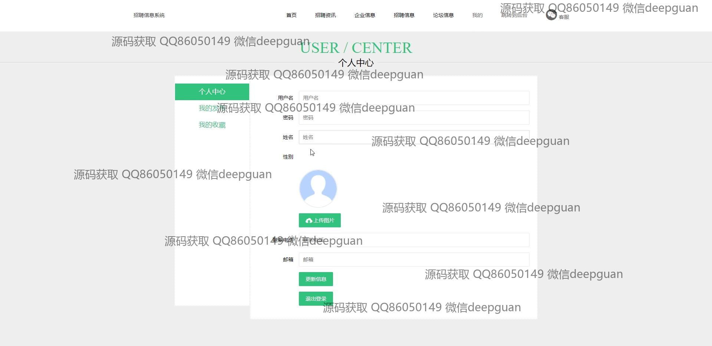

<h1 align="center">的招聘信息应聘系统</h1>

## 简介
招聘信息应聘系统：角色分为管理员、用户、企业；提供个人信息管理、招聘信息管理、简历管理、应聘邀请管理、论坛互动等功能，支持职位搜索与在线申请。    --计算机毕业设计源码；毕设源码；java毕业设计源码

## 联系方式

<h3 align="center">获取完整代码与数据库文件 + 微信：deepguan QQ: 86050149 QQ群: 783742310</h3>

<h3 align="center">可帮忙远程部署 包运行成功！提供远程部署、修改代码、设计文档指导、代码讲解等服务！</h3>

## 功能介绍（完整见运行截图）
管理员：基本功能包括登录、注册、密码修改和角色选择。管理系统的信息界面，提供企业信息管理、招聘信息管理、用户管理和职位分类管理等模块。可以查看和维护招聘资讯，执行查询、添加、修改、和删除操作。可以在论坛中查看和发布信息，以及管理招聘邀请和应聘信息。

用户：基本功能包括登录、注册、退出和密码修改。个人中心功能允许用户查看和更新个人信息，包括简历管理和应聘信息管理。用户可以查看招聘职位列表，按关键词搜索感兴趣的职位，并在线提交简历。允许通过论坛与企业和其他用户互动，查看招聘信息和应聘邀请。提供职位推荐和企业信息浏览，帮助用户高效管理求职活动。

## 运行截图

本代码来源于网络,仅供学习参考使用!

